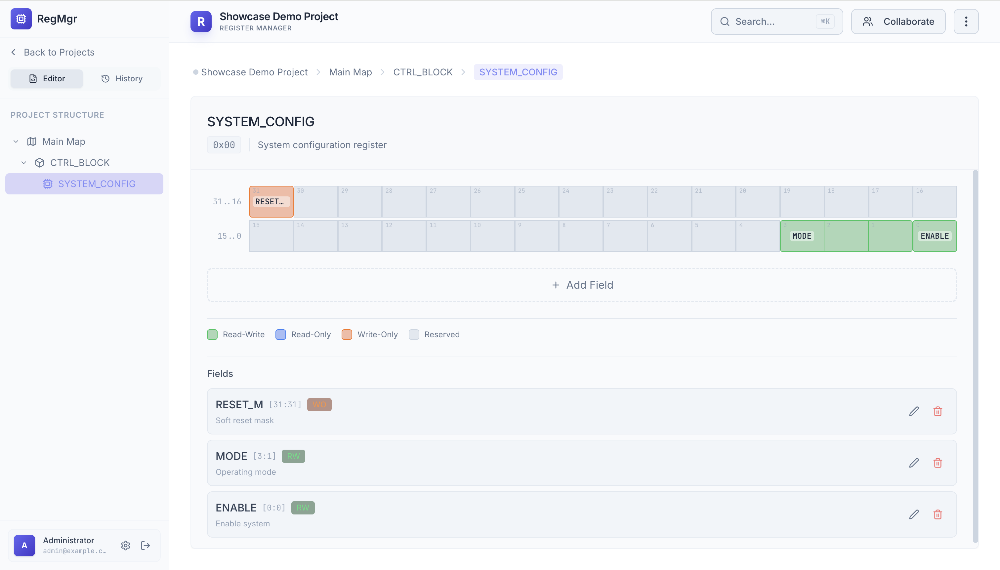
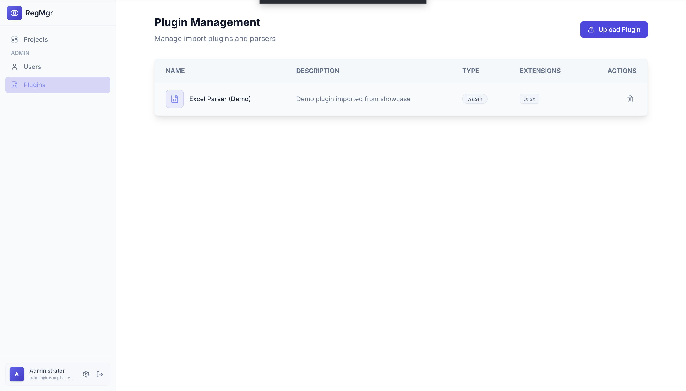
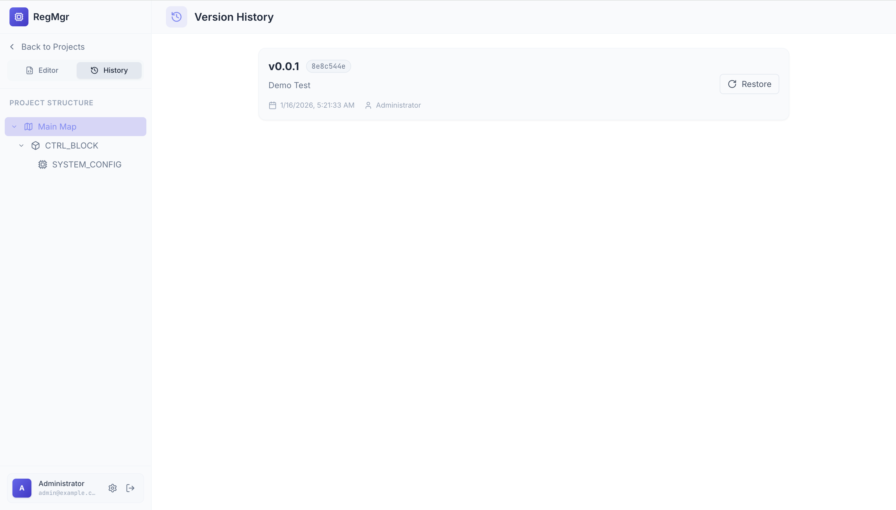
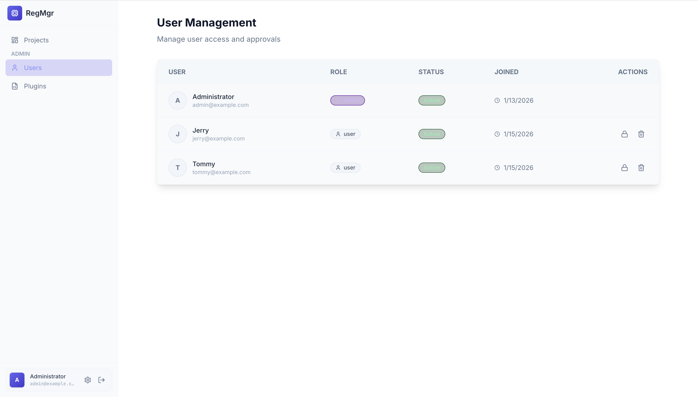

# Register Manager

符合 IEEE 1685-2022 IP-XACT 标准的高性能 Web 寄存器管理工具。采用现代技术栈（Bun, Hono, React, Rust/WASM）构建，旨在提供极致的用户体验。

[English Documentation](./README.md)

## 功能特性

### 核心功能 ✅
- 🎨 **可视化寄存器编辑器** - 交互式 UI，支持拖拽选择位域，轻松管理寄存器。
- 📊 **实时可视化** - 动态位域图渲染和内存映射层次结构展示。
- 🗂️ **项目管理** - 支持多项目管理及版本控制。
- 🔒 **安全认证** - 基于 Email/Password 的安全登录 (集成 Better Auth)。
- ⚙️ **插件系统** - 基于 WASM 的可扩展插件架构,支持**针对不同公司或项目的寄存器格式进行客制化**。
- ⚡ **动态加载** - 支持热加载插件（WASM + JS），无需重新编译应用。

### 数据处理 ✅
- 📥 **Excel 导入** - 通过 WASM 插件客制化（如 Rust 解析器示例），以处理您组织特定的各种 Excel 格式。
- 📤 **多格式导出**
  - IP-XACT XML (IEEE 1685-2022)
  - C 语言头文件 (支持宏定义及大小端控制)
  - UVM RAL (SystemVerilog)
  - HTML 文档

### 架构设计 🏗️
- **Monorepo**: 使用 Bun Workspaces 高效管理多包项目。
- **前端**: React + Vite + TailwindCSS (打造高级 UI/UX)。
- **后端**: Hono + Drizzle ORM + PostgreSQL。
- **性能**: 繁重的数据处理任务通过 **WASM** (Rust) 卸载执行。

## 功能展示 📸

### 可视化寄存器编辑器
直观的寄存器和位域管理界面。


### 强大的插件系统
通过 WASM 插件客制化导入/导出逻辑，以支持您特定的寄存器格式。


### 可靠的导入系统
支持从 Excel 导入历史数据，并提供预览功能。


### 多格式导出
支持导出 IP-XACT, C Header, UVM RAL, 和 HTML 文档。


### 版本控制
项目版本管理与快照功能。


### 用户管理
基于角色的多用户安全管理系统。


## 快速开始

### 前置要求
- [Bun](https://bun.sh/) >= 1.0 (运行时 & 包管理器)
- [PostgreSQL](https://www.postgresql.org/) >= 14
- [Rust](https://www.rust-lang.org/) (用于构建 WASM 插件)
- `wasm-bindgen-cli` (`cargo install wasm-bindgen-cli --locked`)

### 安装步骤

```bash
# 1. 安装依赖
bun install

# 2. 环境配置
cp .env.example packages/backend/.env
# 编辑 packages/backend/.env 配置您的 DATABASE_URL

#（可选）生成 BETTER_AUTH_SECRET（本地开发用）
# 只打印：BETTER_AUTH_SECRET=...
bun run auth:secret
# 或追加写入到 packages/backend/.env（若已存在则不会覆盖）
bun run auth:secret -- --write

# 3. 数据库迁移
bun run db:generate
bun run db:migrate
bun run db:seed  # 可选：填充初始数据

# 4. 构建插件 (可选，通用 WASM 解析器)
bun run plugin:build

# 5. 启动开发服务器 (前端 + 后端)
bun run dev
```

### 插件开发

插件系统允许您**客制化导入/导出逻辑**以适配不同的寄存器格式。由于每个公司或项目可能有独特的 Excel/数据格式，WASM 插件提供了一种灵活的方式来使工具适应您的特定需求。

#### 支持的语言

WASM 插件系统支持可以编译为 WebAssembly 的语言：
- ✅ **Rust** (推荐) - 通过 `wasm-bindgen` 提供最佳工具链支持，性能优异
- ✅ **C/C++** - 通过 Emscripten 或 wasm32 target
- ✅ **Go** - 通过 TinyGo 生成较小的二进制文件
- ✅ **AssemblyScript** - TypeScript 风格语法，专为 WASM 设计
- ✅ **Zig** - 原生支持 WASM，体积小巧

#### 插件要求

您的插件必须：
1. **导出解析函数**，签名如：`parse_excel(fileBytes: Uint8Array) -> ImportData`
2. **编译为 `.wasm`** 二进制格式
3. **生成 JS 胶水代码** 以供浏览器集成（例如 Rust 的 `wasm-bindgen`）
4. **返回数据** 符合 `ImportData` 数据结构（见 `packages/shared/src/types/import.ts`）

#### 示例：基于 Rust 的解析器

```bash
# 构建 WASM 并生成 JS 胶水代码
bun run plugin:build
```
输出文件位于 `examples/parser_plugin_rust/pkg/` 目录。
- **动态模式**: 通过管理后台上传 `pkg/parser_plugin_rust_bg.wasm` (二进制) 和 `pkg/parser_plugin_rust.js` (JS 胶水代码)，即可立即启用插件。
- **适用于**: 生产环境、性能关键应用、小包体积 (~200KB)
- **源码**: 见 `examples/parser_plugin_rust/` 目录获取完整实现

## 项目结构

```
register_manager/
├── packages/
├── backend/             # Hono API 服务器
├── frontend/            # React 应用程序
└── shared/              # 共享类型定义 & Schema
├── examples/
│   └── parser_plugin_rust/  # 示例：基于 Rust 的 WASM 解析器插件
└── package.json
```

## 许可证

MIT
